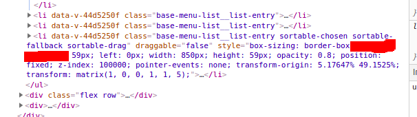

# Hello Vue Components

> This is just a clone of [chrisvfritz hello-vue-components](https://github.com/chrisvfritz/hello-vue-components) to test stuff

## Usage

### Directly in the browser

Drop the library in with a `<script>` tag alongside Vue to globally install all components:

```html
<div id="app">
  <hello-a></hello-a>
  <hello-b></hello-b>
</div>

<script src="https://unpkg.com/vue"></script>
<script src="https://unpkg.com/vue-package-test-x"></script>
<script>
  new Vue({ el: '#app' })
</script>
```

Or, if you only want to use a small subset of components, drop them in individually:

```html
<div id="app">
  <hello-a></hello-a>
  <hello-b></hello-b>
</div>

<script src="https://unpkg.com/vue"></script>
<script src="https://unpkg.com/vue-package-test-x/HelloA"></script>
<script src="https://unpkg.com/vue-package-test-x/HelloB"></script>
<script>
  new Vue({ el: '#app' })
</script>
```

### In a module system

Install the library with NPM:

```bash
npm install vue-package-test-x
```

Then register the library as a plugin to globally install all components:

```js
import HelloVueComponents from 'vue-package-test-x'

Vue.use(HelloVueComponents)
```

Or, import components individually for local registration:

```js
import { HelloA, HelloB } from 'vue-package-test-x'

export default {
  components: { HelloA, HelloB }
}
```

#### Individually packaged components

If you only want to use a small subset of components, only import individually packaged components to reduce the size of your application:

```js
import HelloA from 'vue-package-test-x.HelloA'
import HelloB from 'vue-package-test-x.HelloB'
```


[{:height="50%" width="50%"}](https://www.browserstack.com)


